<a name="top"></a>

<div align="center">



<br />

<a href="https://github.com/Hacking-Notes/Wayback-Crawler/stargazers"></a>
<a href="https://github.com/Hacking-Notes/Wayback-Crawler/network/members"></a>
<a href="https://github.com/Hacking-Notes/Wayback-Crawler/commits"></a>
<a href="LICENSE"></a>
<a href="https://hacking-notes.com"></a>

</div>

<br />

A powerful tool for discovering and analyzing subdomains using Wayback Machine data and certificate transparency logs.

## Features

- 🔍 Subdomain discovery using multiple sources
  - Certificate Transparency logs (crt.sh)
  - Wayback Machine archives
- ⚡ Asynchronous processing for fast scanning
- 🎯 Active subdomain status checking
- 🔒 Vulnerability parameter detection
- 📊 Beautiful console output with rich formatting
- 💾 JSON export support
- ⚙️ Highly configurable


## Installation

1. Clone the repository:
```bash
git clone https://github.com/Hacking-Notes/Wayback-Crawler.git
cd Wayback-Crawler
```

2. Install dependencies:
```bash
pip install -r requirements.txt
```


## Usage

Basic usage:
```bash
python -m wayback_crawler example.com
```

Full options:
```bash
python -m wayback_crawler DOMAIN

Arguments:
  DOMAIN  Target domain (e.g., example.com)  [required]

Options:
  -a, --active                Check if subdomains are active
  -v, --vulnerable           Check for vulnerable parameters
  -w, --wordlist PATH        Custom wordlist for parameter checking
  -o, --output TEXT          Output format (json/text)  [default: json]
  -c, --concurrent INTEGER   Maximum concurrent requests  [default: 50]
  -t, --timeout FLOAT        Request timeout in seconds  [default: 10.0]
  --no-verify-ssl           Disable SSL verification
  --help                    Show this message and exit.
```

### Examples

1. Basic subdomain discovery:
```bash
python -m wayback_crawler scan example.com
```

2. Check if discovered subdomains are active:
```bash
python -m wayback_crawler example.com --active
```

3. Check for vulnerable parameters:
```bash
python -m wayback_crawler example.com --vulnerable
```

4. Use custom wordlist for parameter checking:
```bash
python -m wayback_crawler example.com --vulnerable --wordlist my_wordlist.txt
```

5. Increase concurrent requests for faster scanning:
```bash
python -m wayback_crawler example.com --active --concurrent 100
```


## Output

The tool provides two types of output:

1. Console output with rich formatting showing:
   - Discovered subdomains with status
   - Potentially vulnerable parameters
   - Scan summary

2. JSON output file containing detailed information about:
   - All discovered subdomains
   - Active status and response times
   - Server information
   - Vulnerable parameters
   - Scan configuration and timing


## Contributing

Contributions are welcome! Please feel free to submit a Pull Request.


## License

This project is licensed under the MIT License - see the LICENSE file for details.


## 🧰 Hacking Notes Ecosystem

<div align="center">

🌐 &nbsp;**[hacking-notes.com](https://hacking-notes.com)** &nbsp;·&nbsp; ✍️ &nbsp;**[blog](https://hacking-notes.medium.com/)** &nbsp;·&nbsp; 💬 &nbsp;**[discord](https://discord.gg/r68ameNHrD)**

</div>

| | Resource | What you get |
| :-: | -------- | ------------ |
| 🗺 | **[Hacker-Roadmap](https://github.com/Hacking-Notes/Hacker-Roadmap)** | Structured paths from beginner to pro — hobbyist, bug bounty, certs & degree. |
| 🔴 | **[RedTeam Notes](https://github.com/Hacking-Notes/RedTeam)** | Offensive security notes: recon, exploitation, Windows & Linux. |
| 🔷 | **[BlueTeam Notes](https://github.com/Hacking-Notes/BlueTeam)** | Defensive security notes: forensics, malware, log & packet analysis. |
| 🧩 | **[Extensions](https://github.com/Hacking-Notes/Extensions)** | Curated Chrome extensions for ethical hacking & recon. |
| 🔖 | **[Bookmarks](https://github.com/Hacking-Notes/Bookmarks)** | Curated hacker bookmark collection, one import away. |


<div align="right"><a href="#top">⬆ back to top</a></div>
